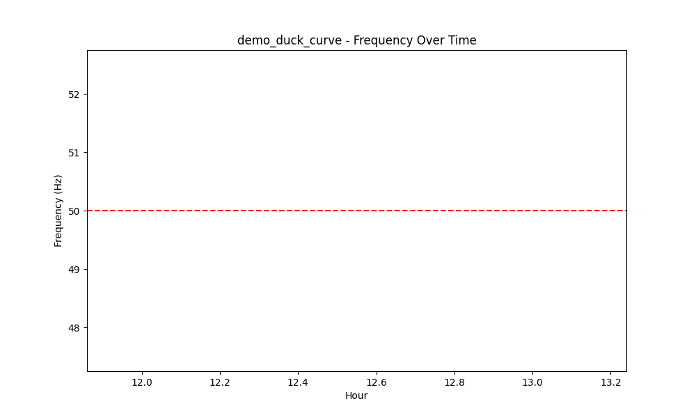
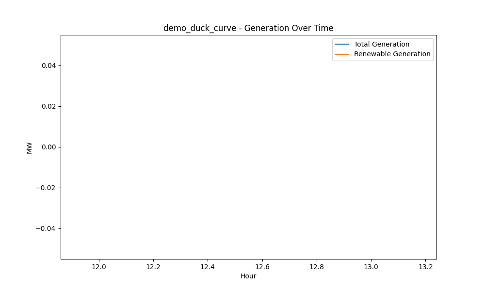
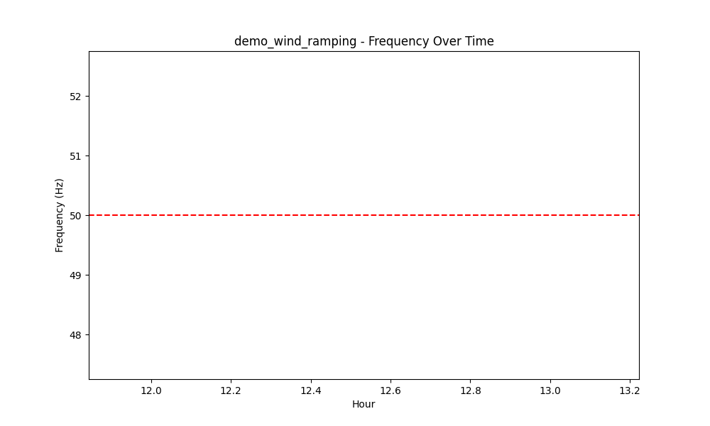
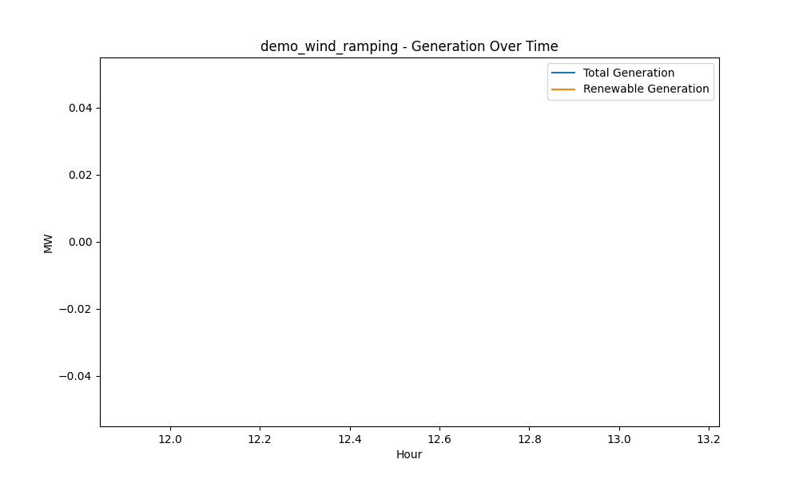
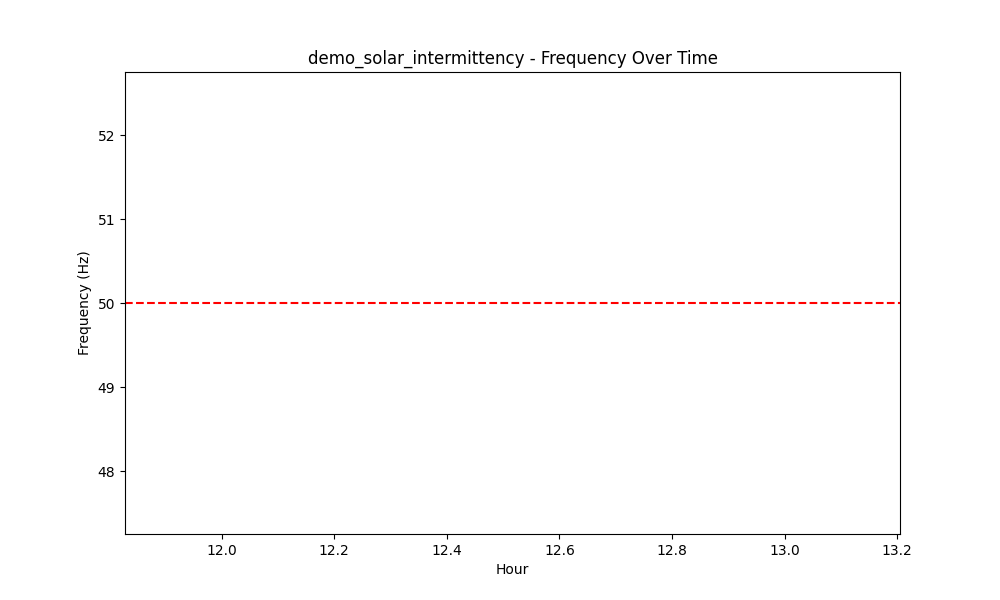
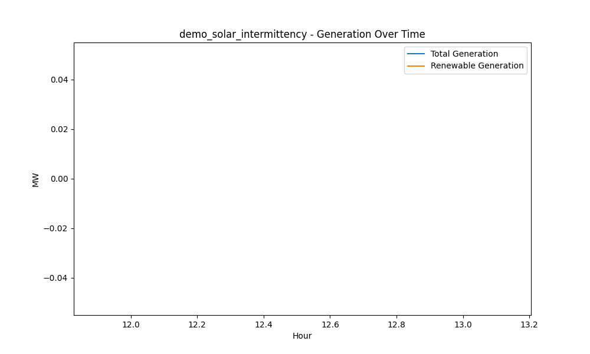

# Renewable Energy Integration Stress Test Results

**Analysis Date:** July 13, 2025
**Tests Analyzed:** 3
**Blackout Scenarios:** 3

## Executive Summary

Average System Cost: $50,656.37
Average Renewable Penetration: 0.0%
Average Frequency: 50.06 Hz

## Test Scenarios Overview

|                          | test_name                |   total_system_cost |   average_clearing_price |   renewable_penetration |   frequency_hz |   voltage_pu |   total_generation_mw |   renewable_generation_mw |   reserve_margin_mw |   frequency_violations |   market_clearings |   storage_soc |   storage_utilization |   storage_revenue |
|:-------------------------|:-------------------------|--------------------:|-------------------------:|------------------------:|---------------:|-------------:|----------------------:|--------------------------:|--------------------:|-----------------------:|-------------------:|--------------:|----------------------:|------------------:|
| demo_duck_curve          | demo_duck_curve          |             64246.9 |                  367.125 |                       0 |        49.8072 |     0.998559 |                 175   |                         0 |                -400 |                      1 |                  1 |       52.8917 |               12.8521 |                 0 |
| demo_wind_ramping        | demo_wind_ramping        |             38000   |                  160     |                       0 |        50.5134 |     1.01277  |                 237.5 |                         0 |                -400 |                      1 |                  1 |       43.5828 |               25.6687 |                 0 |
| demo_solar_intermittency | demo_solar_intermittency |             49722.2 |                  198.889 |                       0 |        49.8733 |     0.992817 |                 250   |                         0 |                -400 |                      1 |                  1 |       52.7874 |               12.6702 |                 0 |

## Blackout Scenarios Summary

|                      |   total_events |   duration_hours |   avg_freq_dev |   system_cost |   reliability_score |
|:---------------------|---------------:|-----------------:|---------------:|--------------:|--------------------:|
| texas_winter_uri     |             23 |             11.5 |       0.919029 |        135752 |             36.1194 |
| california_heat_wave |             15 |              7.5 |       1.51333  |        112072 |             39.5582 |
| winter_storm_elliott |              8 |              4   |       0.949567 |        149079 |             41.7597 |

## Detailed Analysis

### demo_duck_curve
- Total Cost: $64,246.88
- Renewable Penetration: 0.0%
- Frequency: 49.81 Hz
- Reserve Margin: -400.0 MW

### demo_wind_ramping
- Total Cost: $38,000.00
- Renewable Penetration: 0.0%
- Frequency: 50.51 Hz
- Reserve Margin: -400.0 MW

### demo_solar_intermittency
- Total Cost: $49,722.22
- Renewable Penetration: 0.0%
- Frequency: 49.87 Hz
- Reserve Margin: -400.0 MW

## Conclusions

🚨 Critical: Low renewable penetration indicates dispatch issues.
⚠️ Warning: Frequency violations detected.
## Visualizations

### demo_duck_curve

### demo_wind_ramping

### demo_solar_intermittency

