# Smart Grid Multi-Agent System - Agent Documentation

## 🎯 Grid Operator Agent - The Central Coordinator

The Grid Operator Agent serves as the **central brain** of the smart grid system, acting as both an economic coordinator and technical operator. It manages market clearing, ensures grid stability, and coordinates all other agents in the system.

### 📊 **Grid Operator Workflow Diagram**


**Diagram Explanation:**
- **Main Flow (Top)**: Shows the complete market cycle from agent registration to dispatch
- **Market Clearing (Blue Subgraph)**: Details the economic dispatch algorithm with specific price examples
- **Agent Communication (Left Subgraph)**: Illustrates bidirectional communication between all agent types
- **Grid Monitoring (Right Subgraph)**: Shows real-time grid state calculations and frequency control

### 🏗️ **Core Architecture**

```python
class GridOperatorAgent(BaseAgent):
    """
    Central coordinator for the smart grid system
    Responsibilities:
    - Market clearing and economic dispatch
    - Grid stability monitoring and control
    - Agent registration and coordination
    - Emergency response and load shedding
    """
```

### 📊 **Key Data Structures**

#### Grid State Monitoring
```python
@dataclass
class GridState:
    frequency_hz: float = 50.0              # Grid frequency
    voltage_pu: float = 1.0                 # Voltage in per unit
    total_generation_mw: float = 0.0        # Total generation
    total_load_mw: float = 0.0              # Total load
    renewable_generation_mw: float = 0.0    # Renewable generation
    storage_charge_mw: float = 0.0          # Net storage charging
    carbon_intensity_kg_per_mwh: float = 400.0  # Grid carbon intensity
```

#### Market Clearing Results
```python
@dataclass
class MarketResult:
    clearing_price_mwh: float               # Uniform market price
    total_cleared_mw: float                 # Total dispatched power
    cleared_bids: List[Tuple]               # (agent_id, quantity, price)
    system_cost: float                      # Total system cost
    renewable_penetration: float            # % renewable energy
```

## 💰 **Market Clearing Algorithm**

### **Economic Dispatch Process**

The Grid Operator uses a **merit order economic dispatch** algorithm that runs every 5 minutes:

#### **Step 1: Bid Collection**
```python
# Collect bids from all market participants
generation_bids = []      # Supply bids from generators
storage_bids = []         # Charge/discharge bids from storage
demand_response_offers = [] # Demand reduction offers from consumers
```

#### **Step 2: Merit Order Sorting**
```python
# Sort supply bids by price (ascending - cheapest first)
all_supply_bids.sort(key=lambda x: x[0])  # Sort by price per MWh

# Example sorted bids:
# Solar Farm: $25/MWh, 30 MW
# Wind Farm: $30/MWh, 35 MW  
# Coal Plant: $45/MWh, 50 MW
# Gas Plant: $65/MWh, 40 MW
```

#### **Step 3: Supply Curve Construction**
```python
def _find_market_equilibrium(self, supply_bids, baseline_demand, demand_bids):
    cumulative_supply = 0.0
    supply_curve = []
    
    for price, quantity, agent_id, bid_type in supply_bids:
        supply_curve.append((price, cumulative_supply, cumulative_supply + quantity))
        cumulative_supply += quantity
```

#### **Step 4: Market Clearing**
```python
# Find intersection of supply and demand
target_supply = min(baseline_demand, cumulative_supply)

# Dispatch generators in merit order until demand is met
for price, start_qty, end_qty, agent_id, bid_type in supply_curve:
    if total_cleared >= target_supply:
        break
    
    quantity_needed = min(end_qty - start_qty, target_supply - total_cleared)
    cleared_bids.append((agent_id, quantity_needed, price))
    clearing_price = price  # Marginal pricing - last unit sets price
```

### **Market Clearing Example**

**Scenario**: 100 MW demand needs to be met

| Generator | Bid Price | Capacity | Cumulative | Status |
|-----------|-----------|----------|------------|---------|
| Solar | $25/MWh | 30 MW | 30 MW | ✅ Dispatched |
| Wind | $30/MWh | 35 MW | 65 MW | ✅ Dispatched |
| Coal | $45/MWh | 50 MW | 115 MW | ✅ Partially (35 MW) |
| Gas | $65/MWh | 40 MW | 155 MW | ❌ Not needed |

**Result**: 
- **Clearing Price**: $45/MWh (marginal unit price)
- **All generators paid**: $45/MWh (uniform pricing)
- **Total Cost**: $4,500/hour
- **Solar Profit**: ($45-$25) × 30 = $600/hour
- **Wind Profit**: ($45-$30) × 35 = $525/hour

## 🔄 **Agent Coordination & Communication**

### **Message Types & Routing**

The Grid Operator handles multiple message types for system coordination:

```python
class MessageType(Enum):
    GENERATION_BID = "generation_bid"           # Generator → Grid Operator
    DEMAND_RESPONSE_OFFER = "demand_response_offer"  # Consumer → Grid Operator
    DISPATCH_INSTRUCTION = "dispatch_instruction"    # Grid Operator → All
    MARKET_PRICE_UPDATE = "market_price_update"      # Grid Operator → All
    STATUS_UPDATE = "status_update"                  # All ↔ All
```

### **Communication Flow**

#### **Market Cycle Communication**
1. **Bid Request**: Grid Operator → All Agents
2. **Bid Submission**: Agents → Grid Operator
3. **Market Clearing**: Internal algorithm execution
4. **Dispatch Instructions**: Grid Operator → Selected Agents
5. **Market Updates**: Grid Operator → All Agents

#### **Real-time Monitoring**
```python
async def _handle_status_update(self, message):
    # Update agent state tracking
    self.agent_states[message.sender_id].update(message.content)
    
    # Aggregate grid-level metrics
    self._update_grid_aggregates()
    
    # Check for violations and trigger responses
    if self._detect_violations():
        await self._emergency_response()
```

## ⚡ **Grid Stability Management**

### **Frequency Control**

The Grid Operator monitors and controls grid frequency using a simplified model:

```python
def _update_grid_aggregates(self):
    # Calculate supply-demand balance
    balance_error = total_generation - total_load - storage_net
    
    # Simple frequency model: 1 MW imbalance = 0.01 Hz deviation
    frequency_deviation = balance_error * 0.01
    self.grid_state.frequency_hz = 50.0 + frequency_deviation
    
    # Monitor for violations
    if abs(self.grid_state.frequency_hz - 50.0) > 0.1:
        self.reliability_metrics["frequency_violations"] += 1
```

### **Emergency Response System**

```python
async def _emergency_response(self):
    if self.grid_state.frequency_hz < 49.9:
        # Under-frequency: Need more generation or less load
        await self._request_frequency_regulation()
        
        if self.grid_state.frequency_hz < 49.5:
            # Critical: Implement load shedding
            await self._emergency_load_shedding()
    
    elif self.grid_state.frequency_hz > 50.1:
        # Over-frequency: Need less generation or more load
        await self._request_generation_reduction()
```

## 📈 **Performance Metrics & Monitoring**

### **Economic Metrics**
- **Market Efficiency**: Price volatility and clearing frequency
- **System Cost**: Total cost of electricity supply
- **Consumer/Producer Surplus**: Economic welfare measures

### **Technical Metrics**
- **Frequency Stability**: Deviation from 50.0 Hz
- **Voltage Stability**: Deviation from 1.0 per unit
- **Renewable Penetration**: % of renewable energy in the mix
- **Carbon Intensity**: kg CO₂ per MWh

### **Reliability Metrics**
```python
async def calculate_performance_metrics(self):
    return {
        "market_clearing_frequency": len(self.market_efficiency_history),
        "average_clearing_price": np.mean(recent_prices),
        "price_volatility": np.std(recent_prices),
        "frequency_stability_index": frequency_stability * 100,
        "frequency_violations": self.reliability_metrics["frequency_violations"],
        "total_system_cost": self.total_system_cost,
        "renewable_penetration": renewable_percentage,
        "carbon_intensity": self.grid_state.carbon_intensity_kg_per_mwh
    }
```

## 🚨 **Algorithm Limitations & Failure Modes**

### **When the Algorithm Fails**

1. **Insufficient Supply**
   ```python
   if baseline_demand > cumulative_supply:
       # Cannot meet demand - potential blackout
       clearing_price = supply_curve[-1][0]  # Use highest bid price
   ```

2. **No Supply Bids**
   ```python
   if not supply_curve:
       return 0.0, 0.0, []  # Zero clearing - system failure
   ```

3. **Economic Infeasibility**
   - All generators bid above consumer willingness to pay
   - Results in market failure and potential load shedding

### **Missing Real-World Constraints**

The current implementation lacks several critical real-world constraints:

- **Transmission Limits**: No modeling of line capacity constraints
- **Ramping Constraints**: Generators can't change output instantly
- **Minimum Run Times**: Coal plants can't start/stop quickly
- **Reserve Requirements**: No spinning reserve for emergencies
- **N-1 Contingency**: No redundancy planning for equipment failures

## 🎯 **System Objectives**

### **Primary Objectives**
1. **Economic Efficiency**: Minimize total system cost through merit order dispatch
2. **Grid Stability**: Maintain frequency within 49.9-50.1 Hz range
3. **Market Fairness**: Ensure transparent, non-discriminatory market access
4. **Environmental Goals**: Maximize renewable energy integration
5. **Reliability**: Maintain continuous power supply to all consumers

### **Optimization Trade-offs**
- **Cost vs. Reliability**: Cheaper generators may be less reliable
- **Economics vs. Environment**: Coal is cheap but high-carbon
- **Efficiency vs. Stability**: Fast markets may create instability
- **Centralization vs. Autonomy**: Central control vs. agent independence

## 🔮 **Future Enhancements**

### **Advanced Market Mechanisms**
- **Locational Marginal Pricing**: Account for transmission constraints
- **Capacity Markets**: Long-term reliability planning
- **Ancillary Services**: Frequency regulation, voltage support, reserves

### **Enhanced Grid Physics**
- **AC Power Flow**: Realistic electrical modeling
- **Dynamic Frequency Response**: Governor and inertia modeling
- **Voltage Control**: Reactive power and transformer tap control

### **Machine Learning Integration**
- **Demand Forecasting**: AI-powered load prediction
- **Price Forecasting**: Market price prediction models
- **Anomaly Detection**: Automatic detection of system abnormalities

---

*The Grid Operator Agent represents the evolution from traditional centralized grid control to intelligent, market-driven coordination that balances economic efficiency with system reliability.*

## 🏭 Generator Agent - AI-Powered Power Plant

The Generator Agent represents an intelligent power plant that uses **Deep Q-Network (DQN)** reinforcement learning to optimize its bidding strategy in the electricity market. Each generator learns to maximize profit while contributing to grid stability.

### 📊 **Generator Agent Workflow Diagram**

```mermaid
graph TD
    A["Generator Agent"] --> B["Monitor Market Conditions"]
    B --> C["Encode State Vector<br/>64 dimensions"]
    C --> D["DQN Decision Making"]
    
    D --> E["Epsilon-Greedy<br/>Action Selection"]
    E --> F{"Explore vs Exploit"}
    F -->|"ε = 0.1"| G["Random Action<br/>Exploration"]
    F -->|"1-ε = 0.9"| H["Q-Network Action<br/>Exploitation"]
    
    G --> I["Decode Action<br/>Price × Quantity"]
    H --> I
    
    I --> J["Submit Market Bid"]
    J --> K["Wait for Market Clearing"]
    K --> L["Receive Market Result"]
    
    L --> M["Calculate Reward<br/>Multi-objective Function"]
    M --> N["Store Experience<br/>Prioritized Replay Buffer"]
    N --> O["Train DQN Network"]
    
    O --> P["Update Generator State"]
    P --> Q["Soft Update Target Network"]
    Q --> R["Next Market Cycle"]
    R --> B
    
    subgraph STATE ["State Encoding (64D)"]
        S1["Market Prices (0-11)<br/>Current + History + Forecast"]
        S2["Generator Status (12-23)<br/>Online, Output, Costs, Efficiency"]
        S3["Grid Conditions (18-29)<br/>Demand, Weather, Competition"]
        S4["Time Features (32-39)<br/>Hour, Day, Month, Season"]
        S5["Economic Indicators (48-55)<br/>Last Bid, Carbon Price"]
        S6["Environmental (56-63)<br/>Emissions, Carbon Cost"]
    end
    
    subgraph ACTION ["Action Space (20 Actions)"]
        A1["Price Levels: 5 options<br/>0.8x, 0.9x, 1.0x, 1.1x, 1.2x MC"]
        A2["Quantity Levels: 4 options<br/>0%, 25%, 50%, 75%, 100% capacity"]
        A3["Special Actions<br/>Startup Bid, Shutdown Bid"]
        
        A1 --> A4["Action = Price_idx × 5 + Qty_idx"]
        A2 --> A4
        A4 --> A5["20 Discrete Actions Total"]
    end
    
    subgraph REWARD ["Multi-Objective Reward"]
        R1["Revenue Component<br/>α₁ × (Cleared_MW × Price)"]
        R2["Cost Component<br/>α₂ × (Fuel + Startup + Shutdown)"]
        R3["Stability Penalty<br/>α₃ × (Freq_dev + Volt_dev)"]
        R4["Environmental Bonus<br/>α₄ × Renewable_penetration"]
        
        R1 --> R5["Total Reward<br/>α₁×Revenue - α₂×Cost - α₃×Penalty + α₄×Bonus"]
        R2 --> R5
        R3 --> R5
        R4 --> R5
    end
    
    subgraph DQN ["Deep Q-Network Architecture"]
        D1["Input Layer: 64 neurons<br/>State Vector"]
        D2["Hidden Layer 1: 128 neurons<br/>ReLU activation"]
        D3["Hidden Layer 2: 64 neurons<br/>ReLU activation"] 
        D4["Hidden Layer 3: 32 neurons<br/>ReLU activation"]
        D5["Output Layer: 20 neurons<br/>Softmax (Q-values)"]
        
        D1 --> D2 --> D3 --> D4 --> D5
    end
    
    style A fill:#ff6b6b,stroke:#333,stroke-width:3px,color:#fff
    style D fill:#4ecdc4,stroke:#333,stroke-width:2px,color:#fff
    style M fill:#ffe66d,stroke:#333,stroke-width:2px
    style O fill:#95e1d3,stroke:#333,stroke-width:2px
    style F fill:#ffa726,stroke:#333,stroke-width:2px
```



## 🧠 **Deep Q-Network (DQN) Implementation**

### **Neural Network Architecture**

```python
class DQNNetwork(nn.Module):
    def __init__(self, state_size=64, action_size=20):
        super(DQNNetwork, self).__init__()
        self.fc1 = nn.Linear(state_size, 128)    # Input → Hidden 1
        self.fc2 = nn.Linear(128, 64)            # Hidden 1 → Hidden 2  
        self.fc3 = nn.Linear(64, 32)             # Hidden 2 → Hidden 3
        self.fc4 = nn.Linear(32, action_size)    # Hidden 3 → Output
        
    def forward(self, x):
        x = torch.relu(self.fc1(x))              # ReLU activation
        x = torch.relu(self.fc2(x))
        x = torch.relu(self.fc3(x))
        return torch.softmax(self.fc4(x), dim=-1) # Softmax for Q-values
```

**Network Specifications:**
- **Input**: 64-dimensional state vector
- **Hidden Layers**: 128 → 64 → 32 neurons with ReLU activation
- **Output**: 20 Q-values (one for each possible action)
- **Optimizer**: Adam with learning rate 0.001

### **Prioritized Experience Replay**

```python
class PrioritizedReplayBuffer:
    def __init__(self, capacity=10000, alpha=0.6):
        self.capacity = capacity
        self.alpha = alpha  # Prioritization exponent
        self.buffer = []
        self.priorities = np.zeros((capacity,), dtype=np.float32)
```

**Key Features:**
- **Capacity**: 10,000 experiences
- **Prioritization**: Higher TD-error experiences sampled more frequently
- **Alpha Parameter**: 0.6 (controls prioritization strength)
- **Beta Parameter**: 0.4 (importance sampling correction)

## 📊 **State Space Representation (64 Dimensions)**

### **Market Price Information (Indices 0-11)**
```python
# Current market price
state_vector[0] = current_price / 100.0  # Normalized

# Price history (last 8 hours)
for i, price in enumerate(list(self.price_history)[-8:]):
    state_vector[1 + i] = price / 100.0

# Price forecast (next 3 hours)  
for i, price in enumerate(price_forecast[:3]):
    state_vector[9 + i] = price / 100.0
```

### **Generator Operational Status (Indices 12-23)**
```python
state_vector[12] = float(self.generator_state.online_status)
state_vector[13] = current_output_mw / max_capacity_mw
state_vector[14] = fuel_cost_per_mwh / 100.0
state_vector[15] = efficiency
state_vector[16] = ramp_rate_mw_per_min / 50.0
state_vector[17] = maintenance_hours_remaining / 100.0
```

### **Grid & Environmental Conditions (Indices 18-31)**
```python
# Demand forecast
state_vector[18] = expected_peak / 2000.0

# Weather impact
state_vector[24] = temperature / 40.0
state_vector[25] = wind_speed / 20.0  
state_vector[26] = solar_irradiance / 1000.0

# Time features
state_vector[32] = hour / 24.0
state_vector[33] = weekday / 7.0
state_vector[34] = month / 12.0
```

## 🎯 **Action Space (20 Discrete Actions)**

### **Action Encoding**
```python
def _decode_action(self, action_index: int) -> Dict[str, float]:
    # 5 price levels × 4 quantity levels = 20 actions
    price_levels = [0.8, 0.9, 1.0, 1.1, 1.2]  # Multipliers of marginal cost
    quantity_levels = [0.0, 0.25, 0.5, 0.75, 1.0]  # Fractions of max capacity
    
    price_idx = action_index // 5
    quantity_idx = action_index % 5
    
    marginal_cost = fuel_cost_per_mwh / efficiency + carbon_cost
    bid_price = marginal_cost * price_levels[price_idx]
    bid_quantity = max_capacity_mw * quantity_levels[quantity_idx]
```

### **Action Space Breakdown**

| Action Index | Price Multiplier | Quantity % | Bid Strategy |
|--------------|------------------|------------|--------------|
| 0-3 | 0.8× MC | 0-100% | **Aggressive Pricing** |
| 4-7 | 0.9× MC | 0-100% | **Competitive Pricing** |
| 8-11 | 1.0× MC | 0-100% | **Cost Recovery** |
| 12-15 | 1.1× MC | 0-100% | **Profit Maximization** |
| 16-19 | 1.2× MC | 0-100% | **Premium Pricing** |

**Special Actions:**
- **Startup Bid**: When offline and bidding quantity > 0
- **Shutdown Bid**: When online and bidding quantity = 0

## 💰 **Multi-Objective Reward Function**

### **Reward Components**
```python
def _calculate_reward(self, action, market_result) -> float:
    # 1. Revenue Component (α₁ = 1.0)
    revenue = cleared_quantity * clearing_price
    
    # 2. Operating Costs (α₂ = 1.0)
    fuel_cost = cleared_quantity * fuel_cost_per_mwh / efficiency
    startup_cost = startup_cost if startup_bid else 0
    shutdown_cost = shutdown_cost if shutdown_bid else 0
    operating_costs = fuel_cost + startup_cost + shutdown_cost
    
    # 3. Grid Stability Penalty (α₃ = 0.5)
    frequency_deviation = abs(frequency_hz - 50.0)
    voltage_deviation = abs(voltage_pu - 1.0)
    stability_penalty = (frequency_deviation * 1000 + voltage_deviation * 100) * cleared_quantity
    
    # 4. Environmental Bonus (α₄ = 0.3)
    environmental_bonus = renewable_penetration * 10 * cleared_quantity
    
    # Combined Reward
    reward = (α₁ × revenue - α₂ × operating_costs - 
              α₃ × stability_penalty + α₄ × environmental_bonus)
    
    return reward / 1000.0  # Scale for numerical stability
```

### **Reward Function Analysis**

**Positive Rewards:**
- **High Revenue**: Clearing at high prices with high quantity
- **Environmental Bonus**: Higher reward when renewable penetration is high
- **Efficient Operation**: Lower fuel costs increase net reward

**Negative Penalties:**
- **Operating Costs**: Fuel, startup, and shutdown costs
- **Grid Instability**: Frequency and voltage deviations penalized
- **Inefficient Bidding**: Not clearing in the market

## 🔄 **Learning Process**

### **Training Loop**
```python
def _train_dqn(self):
    # 1. Sample prioritized experiences
    samples, indices, weights = self.replay_buffer.sample(batch_size=32)
    
    # 2. Calculate current Q-values
    current_q_values = self.q_network(states).gather(1, actions.unsqueeze(1))
    
    # 3. Calculate target Q-values
    next_q_values = self.target_network(next_states).max(1)[0].detach()
    target_q_values = rewards + (gamma * next_q_values * ~dones)
    
    # 4. Compute TD error and loss
    td_errors = target_q_values.unsqueeze(1) - current_q_values
    loss = (weights.unsqueeze(1) * td_errors.pow(2)).mean()
    
    # 5. Backpropagation
    self.optimizer.zero_grad()
    loss.backward()
    self.optimizer.step()
    
    # 6. Update priorities and target network
    priorities = abs(td_errors.detach().numpy().flatten()) + 1e-6
    self.replay_buffer.update_priorities(indices, priorities)
    
    # Soft update target network (τ = 0.001)
    for target_param, local_param in zip(self.target_network.parameters(), 
                                        self.q_network.parameters()):
        target_param.data.copy_(τ * local_param.data + (1.0 - τ) * target_param.data)
```

### **Exploration vs Exploitation**
- **Epsilon-Greedy**: ε = 0.1 (10% exploration, 90% exploitation)
- **Exploration**: Random action selection for market discovery
- **Exploitation**: Q-network selects highest value action
- **Decay Schedule**: Epsilon can be decayed over time for less exploration

## 📈 **Bidding Strategy Evolution**

### **Learning Phases**

#### **Phase 1: Random Exploration (Early Training)**
- **High Epsilon**: Random bidding to explore action space
- **Market Discovery**: Learning price-quantity relationships
- **Experience Collection**: Building replay buffer

#### **Phase 2: Pattern Recognition (Mid Training)**
- **Reduced Epsilon**: More exploitation of learned patterns
- **Price Forecasting**: Learning to predict market conditions
- **Competitor Analysis**: Understanding market dynamics

#### **Phase 3: Strategic Optimization (Mature Training)**
- **Low Epsilon**: Primarily exploiting learned strategy
- **Profit Maximization**: Optimizing bid timing and pricing
- **Risk Management**: Balancing revenue vs. stability penalties

### **Strategic Behaviors Learned**

1. **Peak Hour Bidding**: Higher prices during high demand periods
2. **Ramping Strategy**: Gradual output changes to avoid penalties
3. **Startup Optimization**: Strategic timing of plant startup/shutdown
4. **Weather Adaptation**: Adjusting bids based on renewable output forecasts
5. **Competition Response**: Adapting to other generators' strategies

## 🎯 **Generator Objectives & Trade-offs**

### **Primary Objectives**
1. **Profit Maximization**: Revenue - Operating Costs
2. **Market Competitiveness**: Winning bids consistently  
3. **Grid Stability**: Minimizing frequency/voltage deviations
4. **Environmental Responsibility**: Supporting renewable integration

### **Strategic Trade-offs**
- **Price vs. Quantity**: High price (low probability) vs. Low price (high probability)
- **Startup Costs**: Immediate profit vs. Long-term positioning
- **Grid Services**: Stability support vs. Pure profit maximization
- **Environmental Impact**: Carbon costs vs. Market competitiveness

## 📊 **Performance Metrics**

### **Economic Metrics**
```python
generator_metrics = {
    "capacity_factor": current_output_mw / max_capacity_mw,
    "revenue_per_hour": cleared_quantity * clearing_price,
    "operating_cost_per_hour": fuel_cost + startup_cost + shutdown_cost,
    "profit_per_hour": revenue - operating_costs,
    "bid_success_rate": successful_bids / total_bids
}
```

### **Operational Metrics**
- **Online Time Percentage**: % of time generator is running
- **Ramp Rate Utilization**: How quickly generator changes output
- **Maintenance Scheduling**: Optimal timing of maintenance windows

### **Environmental Metrics**
- **Emissions per Hour**: kg CO₂ per hour of operation
- **Carbon Intensity**: kg CO₂ per MWh generated
- **Renewable Support**: Contribution to grid stability during high renewable periods

## 🚨 **Challenges & Limitations**

### **Market Challenges**
1. **Price Volatility**: Rapid price changes difficult to predict
2. **Competition**: Other generators learning and adapting
3. **Renewable Integration**: Unpredictable renewable output affects clearing
4. **Demand Uncertainty**: Load forecasting errors impact strategy

### **Technical Limitations**
1. **Simplified Grid Physics**: No transmission constraints or AC power flow
2. **Perfect Information**: Assumes complete market transparency
3. **No Equipment Failures**: No random outages or maintenance needs
4. **Discrete Actions**: Limited granularity in bidding options

### **Learning Challenges**
1. **Non-Stationary Environment**: Other agents learning simultaneously
2. **Sparse Rewards**: Market clearing only every 5 minutes
3. **Exploration vs Exploitation**: Balancing learning vs. profit
4. **Generalization**: Adapting to new market conditions

## 🔮 **Future Enhancements**

### **Advanced RL Algorithms**
- **Multi-Agent Deep Deterministic Policy Gradient (MADDPG)**: Continuous action space
- **Proximal Policy Optimization (PPO)**: More stable policy updates
- **Rainbow DQN**: Combining multiple DQN improvements

### **Enhanced State Representation**
- **Attention Mechanisms**: Focus on relevant market signals
- **LSTM Networks**: Better temporal pattern recognition
- **Graph Neural Networks**: Model grid topology and constraints

### **Strategic Improvements**
- **Portfolio Optimization**: Managing multiple generator units
- **Risk Management**: Value-at-Risk and conditional value-at-risk
- **Long-term Contracts**: Forward markets and capacity planning

---

*The Generator Agent demonstrates how artificial intelligence can optimize complex economic decisions in real-time, learning to balance profit maximization with grid stability and environmental responsibility.*

## 🏠 Consumer Agent - Smart Home Energy Manager

The Consumer Agent represents an intelligent household that uses **Multi-Agent Deep Deterministic Policy Gradient (MADDPG)** to optimize energy consumption, comfort, and costs. It manages demand response, EV charging, HVAC systems, and home batteries while considering other agents' actions.

### 📊 **Consumer Agent Workflow Diagram**


## 🧠 **Multi-Agent Deep Deterministic Policy Gradient (MADDPG)**

### **Actor-Critic Architecture**

```python
class MADDPGActor(nn.Module):
    def __init__(self, state_size=40, action_size=4):
        super(MADDPGActor, self).__init__()
        self.fc1 = nn.Linear(state_size, 128)     # Input → Hidden 1
        self.fc2 = nn.Linear(128, 64)             # Hidden 1 → Hidden 2
        self.fc3 = nn.Linear(64, action_size)     # Hidden 2 → Output
        
    def forward(self, state):
        x = torch.relu(self.fc1(state))
        x = torch.relu(self.fc2(x))
        return torch.sigmoid(self.fc3(x))         # Actions in [0,1]

class MADDPGCritic(nn.Module):
    def __init__(self, state_size=40, action_size=4, num_agents=3):
        super(MADDPGCritic, self).__init__()
        # Critic sees ALL agents' states and actions
        total_input = state_size + action_size * num_agents
        self.fc1 = nn.Linear(total_input, 128)
        self.fc2 = nn.Linear(128, 64)
        self.fc3 = nn.Linear(64, 1)               # Single Q-value output
```

**Key Differences from DQN:**
- **Continuous Actions**: Real-valued control signals instead of discrete choices
- **Multi-Agent Awareness**: Critic considers actions from all agents
- **Actor-Critic**: Separate networks for policy (actor) and value estimation (critic)
- **Deterministic Policy**: Actor outputs specific actions, not probabilities

## 📊 **State Space Representation (40 Dimensions)**

### **Home Operational Status (Indices 0-9)**
```python
# Current home state
state_vector[0] = current_load_mw / 100.0           # Normalized load
state_vector[1] = flexible_load_mw / 50.0           # Available flexibility
state_vector[2] = comfort_level / 100.0             # Current comfort
state_vector[3] = comfort_preference / 100.0        # Desired comfort
state_vector[4] = temperature_setpoint / 30.0       # HVAC setpoint
state_vector[5] = ev_battery_soc / 100.0            # EV charge level
state_vector[6] = ev_charging_rate_kw / 50.0        # EV charging rate
state_vector[7] = solar_generation_kw / 20.0        # Solar output
state_vector[8] = battery_soc / 100.0               # Home battery level
state_vector[9] = last_dr_participation             # Previous DR level
```

### **Market Price Information (Indices 10-19)**
```python
# Price signals for decision making
state_vector[10] = current_price / 100.0            # Current $/MWh
state_vector[11:17] = price_history[-6:] / 100.0    # Last 6 hours
state_vector[17:20] = price_forecast[:3] / 100.0    # Next 3 hours
```

### **Environmental & Grid Conditions (Indices 20-33)**
```python
# Weather impact on energy needs
state_vector[20] = outdoor_temp / 40.0              # Temperature
state_vector[21] = humidity / 100.0                 # Humidity
state_vector[22] = solar_irradiance / 1000.0        # Solar potential
state_vector[23] = wind_speed / 20.0                # Wind conditions

# Time-based patterns
state_vector[24] = hour / 24.0                      # Hour of day
state_vector[25] = weekday / 7.0                    # Day of week
state_vector[26] = month / 12.0                     # Month
state_vector[27] = is_weekend                       # Weekend flag

# Grid conditions and opportunities
state_vector[28] = expected_peak / 2000.0           # Grid demand forecast
state_vector[29] = dr_price / 200.0                 # DR payment rate
```

## 🎯 **Continuous Action Space (4 Dimensions)**

### **Action Decoding**
```python
def _decode_actions(self, action_tensor):
    actions = action_tensor.detach().numpy()  # [0,1] range
    
    # Action 0: Demand Response Participation
    dr_participation = actions[0]  # 0% to 100% load reduction
    
    # Action 1: EV Charging Adjustment  
    ev_adjustment = (actions[1] - 0.5) * 2  # Map to [-1,+1]
    # -1 = reduce by 10kW, +1 = increase by 10kW
    
    # Action 2: HVAC Temperature Adjustment
    hvac_adjustment = (actions[2] - 0.5) * 6  # ±3°C change
    
    # Action 3: Home Battery Dispatch
    battery_dispatch = (actions[3] - 0.5) * 2  # ±5kW
    # Positive = discharge (sell), Negative = charge (buy)
    
    return {
        "dr_participation": dr_participation,
        "ev_charging_adjustment": ev_adjustment,
        "hvac_adjustment": hvac_adjustment,
        "battery_dispatch": battery_dispatch
    }
```

### **Action Space Analysis**

| Action | Range | Physical Meaning | Impact |
|--------|-------|------------------|---------|
| **DR Participation** | [0,1] | 0% to 100% load reduction | **Revenue**: DR payments |
| **EV Charging** | [-1,+1] | ±10kW charging adjustment | **Flexibility**: Shift charging times |
| **HVAC Control** | [-1,+1] | ±3°C temperature change | **Comfort**: Temperature satisfaction |
| **Battery Dispatch** | [-1,+1] | ±5kW charge/discharge | **Arbitrage**: Buy low, sell high |

## 💰 **Utility Function (Multi-Objective Reward)**

### **Utility Calculation**
```python
def _calculate_utility(self, actions, market_result):
    # 1. Energy Costs
    actual_load_kw = baseline_load_kw - dr_load_reduction + ev_charging - battery_discharge
    energy_cost = actual_load_kw * current_price_per_kwh
    
    # 2. Demand Response Payments
    dr_payments = dr_load_reduction * dr_payment_rate
    
    # 3. Comfort Level
    temp_deviation = abs(hvac_adjustment)
    comfort_impact = temp_deviation * 5  # Comfort penalty per degree
    current_comfort = comfort_preference - comfort_impact
    
    # 4. Inconvenience Penalty
    inconvenience = (dr_participation * 20 +           # DR disruption
                    abs(ev_adjustment) * 10 +          # EV charging changes  
                    temp_deviation * 15)               # Temperature changes
    
    # Total Utility
    utility = current_comfort - energy_cost + dr_payments - inconvenience
    return utility / 100.0  # Normalize
```

### **Utility Components Breakdown**

**Positive Rewards:**
- **High Comfort**: Maintaining preferred temperature and lifestyle
- **DR Payments**: Revenue from reducing load during peak periods
- **Energy Arbitrage**: Using battery to buy low, sell high
- **Solar Utilization**: Maximizing self-consumption of solar power

**Negative Penalties:**
- **Energy Costs**: Higher prices reduce utility
- **Inconvenience**: Lifestyle disruption from DR participation
- **Comfort Loss**: Temperature deviations from preference
- **EV Charging Disruption**: Changing planned charging schedules

## 🔄 **MADDPG Learning Process**

### **Multi-Agent Experience Storage**
```python
def learn_from_market_result(self, market_result, other_agent_actions):
    # Calculate utility reward
    utility = self._calculate_utility(actions_dict, market_result)
    
    # Store multi-agent experience
    # (own_state, own_action, all_actions, reward, next_state)
    all_actions = np.concatenate([self.current_action] + other_agent_actions)
    
    self.replay_buffer.append((
        self.current_state,      # Own state (40D)
        self.current_action,     # Own action (4D)  
        all_actions,            # All agents' actions (12D for 3 agents)
        utility,                # Reward signal
        next_state,             # Next state (40D)
        False                   # Not terminal
    ))
```

### **Network Training**
```python
def _train_maddpg(self):
    # Sample batch of experiences
    batch = random.sample(self.replay_buffer, batch_size=64)
    
    # Train Critic (Q-function)
    with torch.no_grad():
        # Get target actions for all agents
        next_actions_own = self.actor_target(next_states)
        next_actions_others = get_other_agents_actions(next_states)  # From other agents
        next_actions_all = torch.cat([next_actions_own, next_actions_others], dim=1)
        
        # Calculate target Q-values
        target_q = self.critic_target(next_states, next_actions_all)
        target_q = rewards + gamma * target_q
    
    # Current Q-values
    current_q = self.critic(states, all_actions)
    critic_loss = F.mse_loss(current_q, target_q)
    
    # Train Actor (Policy)
    predicted_actions_own = self.actor(states)
    predicted_actions_all = torch.cat([predicted_actions_own, other_actions], dim=1)
    actor_loss = -self.critic(states, predicted_actions_all).mean()
    
    # Update networks
    self.critic_optimizer.step()
    self.actor_optimizer.step()
    
    # Soft update target networks (τ = 0.001)
    soft_update(self.actor_target, self.actor, tau=0.001)
    soft_update(self.critic_target, self.critic, tau=0.001)
```

## 🏠 **Smart Home Control Systems**

### **Demand Response Strategy**
```python
# DR participation decision
if dr_participation > 0.1:  # Minimum 10% participation
    flexible_load_reduction = flexible_load_mw * dr_participation
    
    # Send DR offer to grid operator
    await self.send_message(
        receiver_id="grid_operator",
        message_type=MessageType.DEMAND_RESPONSE_OFFER,
        content={
            "flexible_load_mw": flexible_load_reduction,
            "duration_hours": 2,
            "price_required_per_mwh": 80.0,  # Minimum acceptable price
            "comfort_constraints": {
                "min_temperature": 20.0,
                "max_temperature": 26.0
            }
        }
    )
```

### **EV Charging Optimization**
```python
# EV charging adjustment
ev_baseline_charging = 7.0  # kW
ev_actual_charging = max(0, ev_baseline_charging + ev_adjustment * 10)

# Update EV battery state
if ev_actual_charging > 0:
    soc_increase = ev_actual_charging / 100.0  # Assume 100 kWh battery
    ev_battery_soc = min(100.0, ev_battery_soc + soc_increase)
```

### **HVAC Control**
```python
# Temperature setpoint adjustment
new_setpoint = current_setpoint + hvac_adjustment
temperature_setpoint = max(18.0, min(28.0, new_setpoint))  # Safety limits

# Comfort impact calculation
comfort_impact = abs(hvac_adjustment) * 5  # Comfort reduction per degree
current_comfort = max(0, comfort_preference - comfort_impact)
```

### **Home Battery Management**
```python
# Battery dispatch decision
battery_power = battery_dispatch * 5.0  # ±5 kW

if battery_power > 0:  # Discharging (selling power)
    soc_decrease = battery_power / 20.0  # Assume 20 kWh battery
    battery_soc = max(0.0, battery_soc - soc_decrease)
    net_load_reduction = battery_power
    
elif battery_power < 0:  # Charging (buying power)
    soc_increase = abs(battery_power) / 20.0
    battery_soc = min(100.0, battery_soc + soc_increase)
    net_load_increase = abs(battery_power)
```

## 📈 **Learning Strategy Evolution**

### **Learning Phases**

#### **Phase 1: Exploration (Early Training)**
- **High Noise**: Random actions to explore control space
- **Comfort Discovery**: Learning comfort-energy trade-offs
- **Market Pattern Recognition**: Understanding price signals

#### **Phase 2: Coordination (Mid Training)**
- **Multi-Agent Awareness**: Learning to respond to other agents
- **Strategic Timing**: Optimal DR participation timing
- **Resource Optimization**: Coordinating EV, battery, and HVAC

#### **Phase 3: Optimization (Mature Training)**
- **Predictive Control**: Anticipating market conditions
- **Comfort Maximization**: Minimizing inconvenience while saving costs
- **Grid Support**: Contributing to system stability

### **Strategic Behaviors Learned**

1. **Peak Shaving**: Reducing load during high-price periods
2. **Load Shifting**: Moving flexible loads to low-price periods
3. **Battery Arbitrage**: Charging during low prices, discharging during high prices
4. **Comfort Optimization**: Minimal temperature adjustments for maximum savings
5. **EV Smart Charging**: Charging when prices are low and grid needs support

## 🎯 **Consumer Objectives & Trade-offs**

### **Primary Objectives**
1. **Cost Minimization**: Reduce electricity bills through smart control
2. **Comfort Maintenance**: Preserve lifestyle and temperature preferences
3. **Revenue Generation**: Earn money through demand response participation
4. **Grid Support**: Contribute to system stability and renewable integration

### **Strategic Trade-offs**
- **Comfort vs. Cost**: Temperature adjustments for energy savings
- **Convenience vs. Revenue**: DR participation inconvenience vs. payments
- **Immediate vs. Future**: Battery charging timing for optimal arbitrage
- **Individual vs. System**: Personal optimization vs. grid stability support

## 📊 **Performance Metrics**

### **Economic Metrics**
```python
consumer_metrics = {
    "total_energy_cost": cumulative_electricity_costs,
    "dr_payments_received": demand_response_revenue,
    "net_savings": dr_payments - energy_costs,
    "utility_score": comfort - costs + payments - inconvenience
}
```

### **Comfort & Lifestyle Metrics**
- **Average Comfort Level**: Temperature satisfaction over time
- **Comfort Stability**: Variance in comfort levels (lower is better)
- **Inconvenience Score**: Cumulative lifestyle disruption
- **DR Participation Rate**: Percentage of DR opportunities accepted

### **Technical Metrics**
- **Load Factor**: Actual load vs. baseline load ratio
- **EV Battery SoC**: Electric vehicle charge level management
- **Home Battery SoC**: Home energy storage utilization
- **Solar Self-Consumption**: Percentage of solar power used locally

## 🚨 **Challenges & Limitations**

### **Multi-Agent Challenges**
1. **Coordination**: Learning optimal responses to other agents' actions
2. **Non-Stationarity**: Other agents learning simultaneously changes environment
3. **Communication**: Limited information about other agents' intentions
4. **Scalability**: Complexity increases exponentially with number of agents

### **Technical Limitations**
1. **Simplified Models**: Basic battery, EV, and HVAC models
2. **Perfect Forecasting**: Assumes accurate price and weather forecasts
3. **No Equipment Failures**: No modeling of system breakdowns
4. **Continuous Actions**: May not reflect discrete appliance controls

### **Behavioral Challenges**
1. **Comfort Quantification**: Difficult to model subjective comfort preferences
2. **Lifestyle Patterns**: Complex human behavior patterns not fully captured
3. **Emergency Situations**: No modeling of urgent energy needs
4. **Social Factors**: No consideration of family dynamics or social preferences

## 🔮 **Future Enhancements**

### **Advanced RL Algorithms**
- **Soft Actor-Critic (SAC)**: Better exploration in continuous action spaces
- **Multi-Agent Proximal Policy Optimization (MAPPO)**: More stable training
- **Attention Mechanisms**: Focus on relevant market signals and agent actions

### **Enhanced Home Modeling**
- **Detailed Thermal Models**: Accurate HVAC and building thermal dynamics
- **Appliance Scheduling**: Individual control of dishwashers, washing machines, etc.
- **Occupancy Patterns**: Learning and adapting to household routines

### **Advanced Coordination**
- **Communication Protocols**: Direct agent-to-agent communication
- **Hierarchical Control**: Neighborhood-level coordination
- **Federated Learning**: Privacy-preserving multi-agent learning

---

*The Consumer Agent showcases how intelligent homes can actively participate in electricity markets, optimizing comfort and costs while supporting grid stability through sophisticated multi-agent reinforcement learning.*
